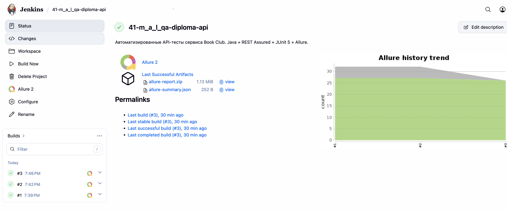
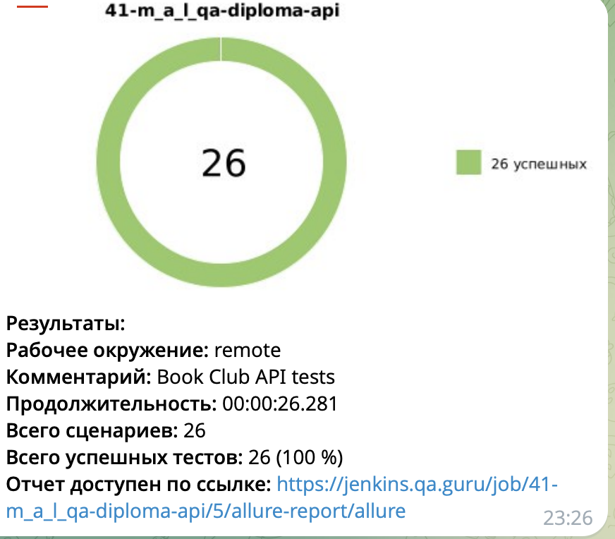

# Проект автоматизации тестирования API Book Club

Проект содержит автоматизированные API-тесты сервиса [Book Club](https://book-club.qa.guru).  

## Содержание

- [Технологии и инструменты](#технологии-и-инструменты)
- [Покрытый функционал](#покрытый-функционал)
- [Структура проекта](#структура-проекта)
- [Локальный запуск](#локальный-запуск)
- [Запуск в Jenkins](#запуск-в-jenkins)
- [Allure Report](#allure-report)
- [Уведомления в Telegram](#уведомления-в-telegram)

## Технологии и инструменты


- Java и Gradle
- JUnit 5
- REST Assured
- AssertJ и Hamcrest
- JSON Schema Validator
- Jackson
- Datafaker
- Allure Report 
- Jenkins и Telegram Bot

## Покрытый функционал

### Регистрация

- успешная регистрация нового пользователя;
- повторная регистрация существующего пользователя;
- валидация пустых и `null` значений;
- проверка ограничения длины пароля.

### Авторизация и выход

- успешное получение access- и refresh-токенов;
- авторизация с неправильным паролем или несуществующим пользователем;
- валидация обязательных полей;
- успешный logout;
- logout без токена, с невалидным токеном и с access-токеном вместо refresh-токена.

### Профиль пользователя

- полное обновление профиля через `PUT`;
- частичное обновление через `PATCH`;
- проверка обязательных полей и пустых значений.

### Книжные клубы

- создание клуба через `POST`;
- получение и поиск клубов через `GET`;
- обновление клуба через `PATCH`;
- удаление через `DELETE` и проверка отсутствия удалённого клуба.

Все сценарии проверяют HTTP status code. Для ответов также используются проверки JSON Schema, значений по JSON path и десериализованных DTO-моделей.

## Структура проекта

```text
src/test/java
├── allure     # подключение шаблонов Allure
├── api        # методы взаимодействия с API
├── config     # конфигурация локального и удалённого запуска
├── models     # request/response DTO
├── specs      # спецификации REST Assured
└── tests      # тесты и генерация тестовых данных

src/test/resources
├── schemas            # JSON-схемы ответов
├── tpl                # шаблоны логирования запросов и ответов Allure
├── local.properties   # настройки локального запуска
└── remote.properties  # настройки запуска в Jenkins
```

## Локальный запуск

Требуется Java 17 или новее. 

```bash
./gradlew clean test
```

По умолчанию используются настройки из `local.properties`. При необходимости адрес API можно переопределить из командной строки:

```bash
./gradlew clean test -DbaseUri=https://book-club.qa.guru -DbasePath=/api/v1
```

Сформировать локальный Allure-отчёт:

```bash
./gradlew allureServe
```

## Запуск в Jenkins

Проект настроен для удалённого запуска в [Jenkins](https://jenkins.qa.guru/job/41-m_a_l_qa-diploma-api/).

[](https://jenkins.qa.guru/job/41-m_a_l_qa-diploma-api/)

Для запуска необходимо открыть job и нажать **Build Now**. Jenkins получает код из GitHub и выполняет:

```bash
./gradlew clean test -Denv=remote
```

В этом режиме используются настройки из `remote.properties`. 
## Allure Report

После завершения сборки Jenkins публикует [Allure Report](https://jenkins.qa.guru/job/41-m_a_l_qa-diploma-api/lastSuccessfulBuild/allure/). Отчёт содержит:

- результаты и длительность тестов;
- группировку по feature и story;
- шаги тестов;
- HTTP-запросы и ответы, добавленные через шаблоны `request.ftl` и `response.ftl`;
- историю запусков.


[](https://jenkins.qa.guru/job/41-m_a_l_qa-diploma-api/lastSuccessfulBuild/allure/#graph)

## Уведомления в Telegram

После завершения Jenkins job Telegram-бот отправляет уведомление с результатом прогона и ссылкой на Allure Report.

Работа интеграции подтверждена [контрольной сборкой №5](https://jenkins.qa.guru/job/41-m_a_l_qa-diploma-api/5/): 26 тестов успешно выполнены, сообщение с диаграммой и ссылкой на отчёт отправлено.

[](https://jenkins.qa.guru/job/41-m_a_l_qa-diploma-api/5/allure/)
